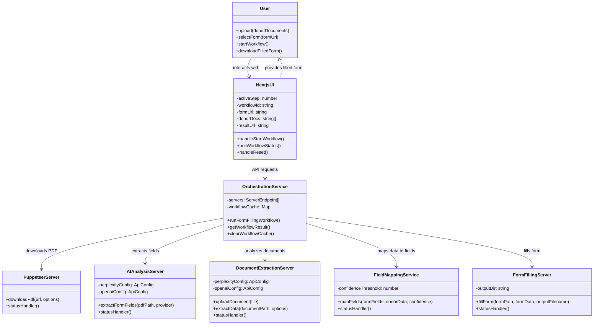
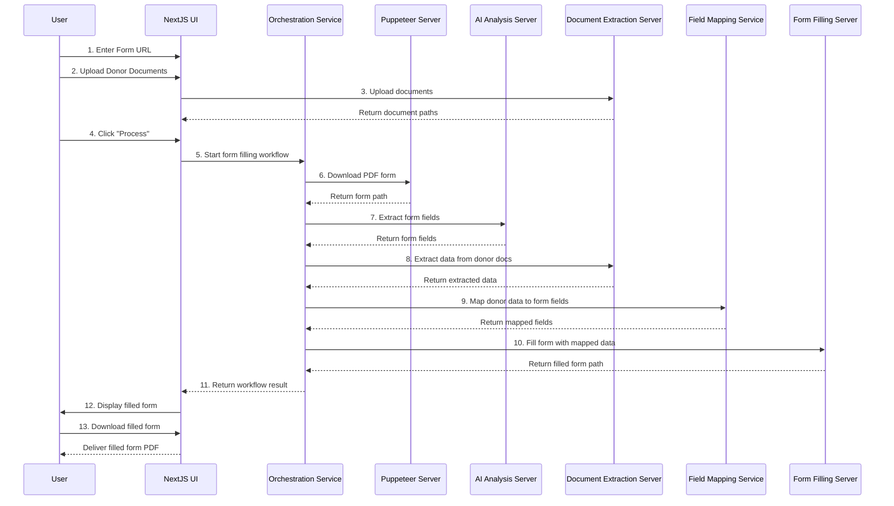
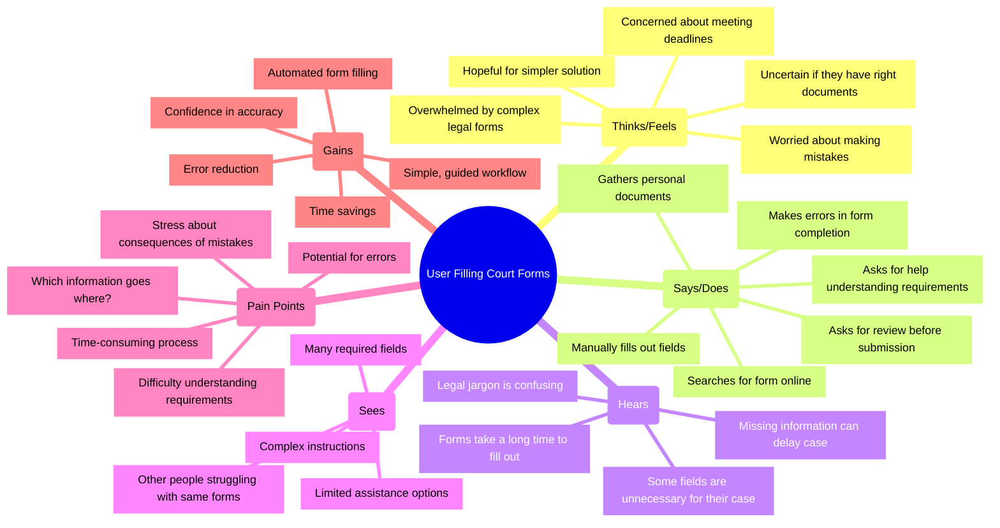
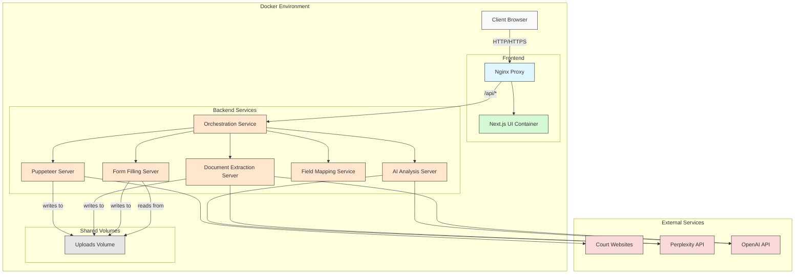

# System Architecture Diagrams

## Class Diagram

This diagram shows the main components of the system and their relationships:

## Workflow Sequence Diagram

This diagram illustrates the step-by-step workflow in the system:

## User Empathy Map

This diagram helps understand the user's perspective and needs:

## Docker Deployment Architecture

This diagram shows the Docker container architecture:

